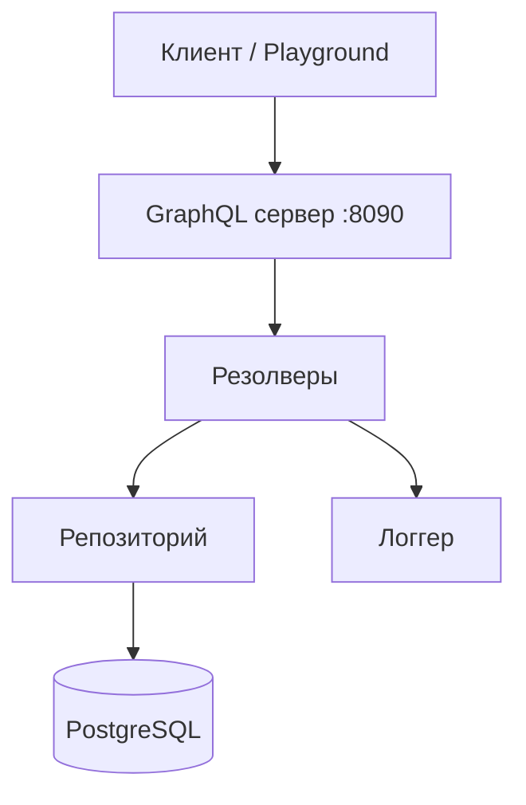
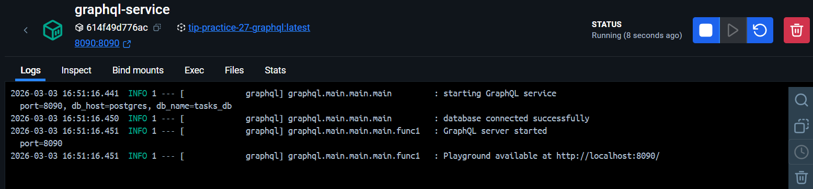
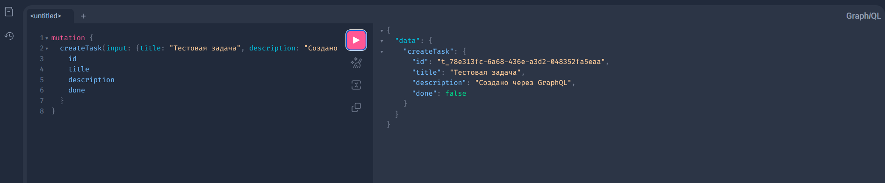
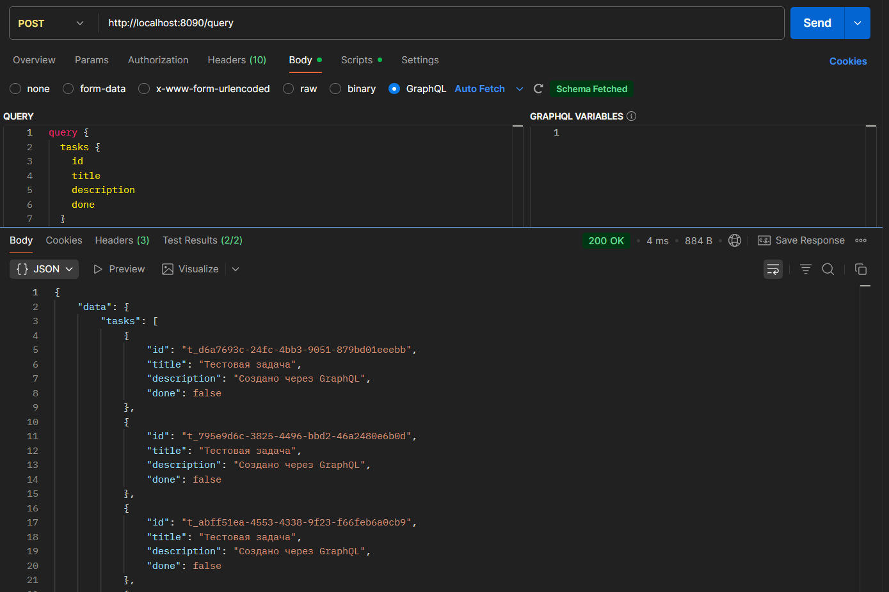
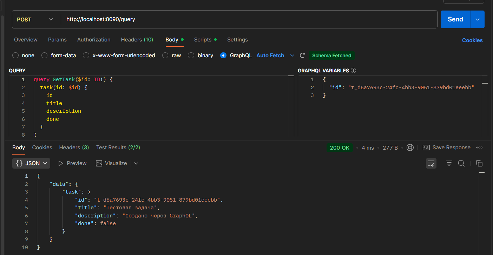
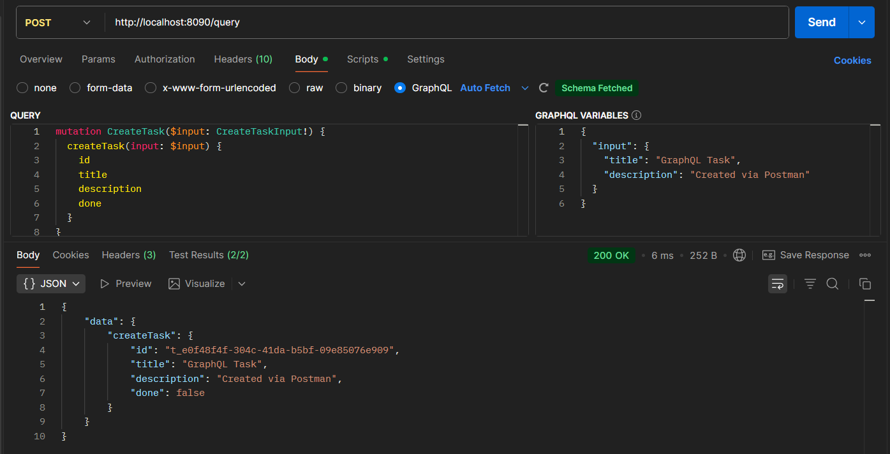
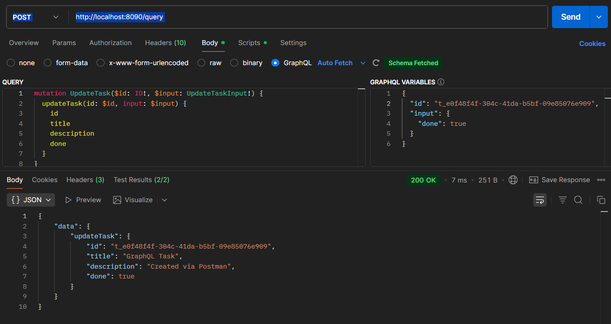
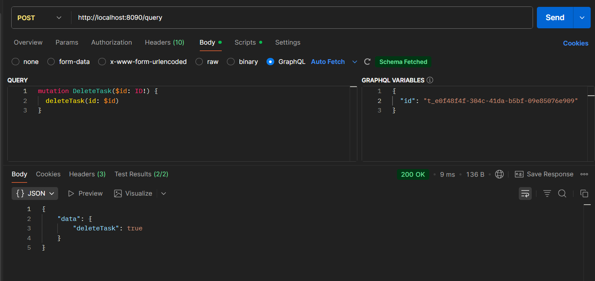
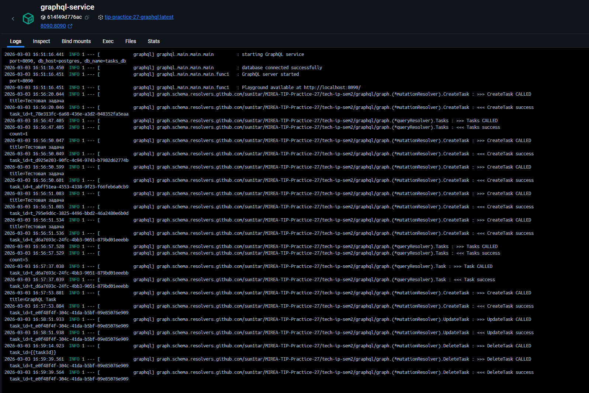

# Практическое занятие №11 (27). Создание GraphQL API с использованием gqlgen. Запросы и мутации


## Выполнил: Туев Д. ЭФМО-01-25

## Содержание

1. [Описание проекта](#описание-проекта)
2. [Архитектура GraphQL сервиса](#архитектура-graphql-сервиса)
3. [GraphQL схема](#graphql-схема)
4. [Реализация резолверов](#реализация-резолверов)
5. [Запуск сервиса](#запуск-сервиса)
6. [Скриншоты выполнения](#скриншоты-выполнения)
7. [Выводы](#выводы)
8. [Контрольные вопросы](#контрольные-вопросы)


---

## Описание проекта

В рамках практического занятия №11 на базе сервиса **Tasks** реализован отдельный **GraphQL сервис** с использованием библиотеки `gqlgen`. Сервис предоставляет GraphQL API для управления задачами, используя ту же базу данных PostgreSQL, что и REST API.

**Цель работы:** Научиться проектировать GraphQL-схему, генерировать серверный каркас gqlgen и реализовывать резолверы для запросов (Query) и изменений (Mutation).

**Архитектура решения:**
- **PostgreSQL** — единая база данных
- **GraphQL service** — отдельный сервис на порту 8090
- **Playground** — доступен по корневому пути для тестирования

---

## Архитектура GraphQL сервиса

### Структура проекта

```
services/graphql/
├── cmd/
│   └── graphql/
│       └── main.go           # Точка входа
├── graph/
│   ├── schema.graphqls       # GraphQL схема (вручную)
│   ├── resolver.go           # Dependency injection (вручную)
│   ├── resolver_impl.go       # Реализация резолверов (вручную)
│   ├── generated.go           # Сгенерированный код (не трогать)
│   ├── models_gen.go          # Сгенерированные модели (не трогать)
│   └── resolver_gen.go         # Сгенерированные интерфейсы (не трогать)
├── internal/
│   ├── config/                # Конфигурация
│   ├── logger/                 # Логирование (Spring-style)
│   └── repository/             # Работа с БД (своя копия)
├── go.mod
├── go.sum
├── gqlgen.yml                  # Конфигурация генерации
└── tools.go                     # Инструменты для go generate
```

### Компоненты

| Компонент | Назначение |
|-----------|------------|
| `schema.graphqls` | Описание типов, запросов и мутаций |
| `gqlgen.yml` | Настройка генерации кода |
| `resolver.go` | DI-контейнер с репозиторием и логгером |
| `resolver_impl.go` | Бизнес-логика резолверов |
| `internal/repository` | Собственная реализация доступа к БД (не зависит от internal пакетов tasks) |
| `internal/logger` | Логгер в стиле Spring Boot для удобной отладки |

### Схема взаимодействия



---

## GraphQL схема

Файл `graph/schema.graphqls`:

```graphql
# GraphQL schema for Tasks service

type Task {
  id: ID!
  title: String!
  description: String
  done: Boolean!
}

input CreateTaskInput {
  title: String!
  description: String
}

input UpdateTaskInput {
  title: String
  description: String
  done: Boolean
}

type Query {
  # Получить список всех задач
  tasks: [Task!]!
  
  # Получить задачу по ID
  task(id: ID!): Task
}

type Mutation {
  # Создать новую задачу
  createTask(input: CreateTaskInput!): Task!
  
  # Обновить существующую задачу
  updateTask(id: ID!, input: UpdateTaskInput!): Task!
  
  # Удалить задачу (возвращает true если удалена, false если не найдена)
  deleteTask(id: ID!): Boolean!
}
```

### Пояснение типов и операций

| Тип/Операция | Описание |
|--------------|----------|
| `Task` | Модель задачи с полями id, title, description, done |
| `CreateTaskInput` | Входные данные для создания задачи (title обязателен, description опционален) |
| `UpdateTaskInput` | Входные данные для обновления задачи (все поля опциональны) |
| `Query.tasks` | Возвращает список всех задач |
| `Query.task` | Возвращает задачу по ID или null, если не найдена |
| `Mutation.createTask` | Создаёт новую задачу и возвращает её |
| `Mutation.updateTask` | Обновляет существующую задачу |
| `Mutation.deleteTask` | Удаляет задачу, возвращает true/false |

---

## Реализация резолверов

Резолверы реализованы в файле `graph/resolver_impl.go`. Ключевые моменты:

### 1. Создание задачи

```go
func (r *mutationResolver) CreateTask(ctx context.Context, input CreateTaskInput) (*Task, error) {
    r.Resolver.Logger.WithField("title", input.Title).Info(">>> CreateTask CALLED")

    now := time.Now()
    dbTask := &repository.Task{
        ID:          "t_" + uuid.New().String(),
        Title:       input.Title,
        Description: "",
        Done:        false,
        CreatedAt:   now,
        UpdatedAt:   now,
    }

    if input.Description != nil {
        dbTask.Description = *input.Description
    }

    if err := r.Resolver.Repo.Create(ctx, dbTask); err != nil {
        return nil, err
    }

    task := &Task{
        ID:          dbTask.ID,
        Title:       dbTask.Title,
        Description: &dbTask.Description,
        Done:        dbTask.Done,
    }

    return task, nil
}
```

### 2. Получение списка задач

```go
func (r *queryResolver) Tasks(ctx context.Context) ([]*Task, error) {
    r.Resolver.Logger.Info(">>> Tasks CALLED")

    dbTasks, err := r.Resolver.Repo.List(ctx)
    if err != nil {
        return nil, err
    }

    tasks := make([]*Task, len(dbTasks))
    for i, dbTask := range dbTasks {
        tasks[i] = &Task{
            ID:          dbTask.ID,
            Title:       dbTask.Title,
            Description: &dbTask.Description,
            Done:        dbTask.Done,
        }
    }

    return tasks, nil
}
```

### 3. Обновление задачи

```go
func (r *mutationResolver) UpdateTask(ctx context.Context, id string, input UpdateTaskInput) (*Task, error) {
    dbTask, err := r.Resolver.Repo.GetByID(ctx, id)
    if err != nil || dbTask == nil {
        return nil, nil
    }

    if input.Title != nil {
        dbTask.Title = *input.Title
    }
    if input.Description != nil {
        dbTask.Description = *input.Description
    }
    if input.Done != nil {
        dbTask.Done = *input.Done
    }
    dbTask.UpdatedAt = time.Now()

    if err := r.Resolver.Repo.Update(ctx, dbTask); err != nil {
        return nil, err
    }

    task := &Task{
        ID:          dbTask.ID,
        Title:       dbTask.Title,
        Description: &dbTask.Description,
        Done:        dbTask.Done,
    }

    return task, nil
}
```

### 4. Удаление задачи

```go
func (r *mutationResolver) DeleteTask(ctx context.Context, id string) (bool, error) {
    err := r.Resolver.Repo.Delete(ctx, id)
    if err == sql.ErrNoRows {
        return false, nil
    }
    if err != nil {
        return false, err
    }
    return true, nil
}
```

### 5. Dependency injection

```go
type Resolver struct {
    Repo   repository.TaskRepository
    Logger *logrus.Logger
}

func NewResolver(repo repository.TaskRepository, logger *logrus.Logger) *Resolver {
    return &Resolver{
        Repo:   repo,
        Logger: logger,
    }
}
```

---

## Запуск сервиса

### Локальный запуск

```bash
cd services/graphql
export DB_HOST=localhost
export DB_PORT=5432
export DB_USER=tasks_user
export DB_PASSWORD=tasks_pass
export DB_NAME=tasks_db
export GRAPHQL_PORT=8090
go run github.com/99designs/gqlgen generate
go run ./cmd/graphql
```

### Запуск через Docker Compose

```bash
cd deploy
docker-compose up -d graphql
```

### Переменные окружения

| Переменная | Значение по умолчанию | Описание |
|------------|----------------------|----------|
| `GRAPHQL_PORT` | 8090 | Порт GraphQL сервера |
| `DB_HOST` | postgres | Хост PostgreSQL |
| `DB_PORT` | 5432 | Порт PostgreSQL |
| `DB_USER` | tasks_user | Пользователь БД |
| `DB_PASSWORD` | tasks_pass | Пароль БД |
| `DB_NAME` | tasks_db | Имя БД |
| `DB_DRIVER` | postgres | Драйвер БД |
| `LOG_LEVEL` | info | Уровень логирования |

### Проверка работоспособности

После запуска Playground доступен по адресу: http://localhost:8090/

---


## Скриншоты выполнения

Тестирование осуществлялось с использованием [коллекции](https://www.postman.com/lively-flare-564043/workspace/learning/collection/42992055-5eb0b316-6f03-44a5-8d9f-6b998f71ad42?action=share&source=copy-link&creator=42992055) 

### 1. Запуск сервиса



### 2. Playground



### 3. Выполнение query tasks



### 4. Выполнение query task



### 5. Выполнение mutation createTask



### 6. Выполнение mutation updateTask



### 7. Выполнение mutation deleteTask



### 8. Логи сервиса при запросах

**Ожидаемое содержимое скриншота:** Логи сервиса с форматированием как в Spring Boot.




---

## Выводы

В ходе выполнения практического занятия №11 были достигнуты следующие результаты:

### Реализация GraphQL сервиса
1. **Создан отдельный сервис** `graphql` на порту 8090, независимый от REST API.
2. **Разработана GraphQL схема** с типами Task, CreateTaskInput, UpdateTaskInput, а также запросами (Query) и мутациями (Mutation).
3. **Настроена генерация кода** с помощью `gqlgen` и конфигурационного файла `gqlgen.yml`.

### Реализация резолверов
1. **Query.tasks** — получение списка всех задач из БД.
2. **Query.task** — получение задачи по ID с обработкой случая "не найдено".
3. **Mutation.createTask** — создание новой задачи с генерацией UUID.
4. **Mutation.updateTask** — обновление только переданных полей (частичное обновление).
5. **Mutation.deleteTask** — удаление задачи с возвратом true/false.

### Работа с данными
1. **Создан собственный репозиторий** в `internal/repository`, независимый от internal-пакетов tasks.
2. **Используется общая БД PostgreSQL**, что обеспечивает консистентность данных.
3. **Реализована обработка ошибок** — при ненайденной задаче возвращается null, а не ошибка.

### Инфраструктура
1. **Логирование в стиле Spring Boot** — цветной вывод с caller-информацией.
2. **Dockerfile** для контейнеризации сервиса.
3. **Интеграция с docker-compose** — сервис запускается вместе с PostgreSQL.

### Тестирование
1. **GraphQL Playground** доступен для ручного тестирования.
2. **Postman коллекция** для автоматизированного тестирования.
3. **Проверены все сценарии**: создание, чтение, обновление, удаление.

### Результаты
- ✅ GraphQL сервис успешно запускается и обрабатывает запросы
- ✅ Все резолверы работают корректно
- ✅ Данные сохраняются в PostgreSQL
- ✅ Логи читаются в удобном формате
- ✅ Playground доступен для тестирования

Таким образом, сервис приобрёл GraphQL API, что позволяет клиентам гибко запрашивать только нужные поля и получать данные в удобном формате.

---

## Контрольные вопросы

### 1. В чём отличие Query и Mutation?

**Query** — предназначен для чтения данных. Выполняется параллельно, гарантирует, что не изменит состояние сервера (идемпотентность).

**Mutation** — предназначен для изменения данных (создание, обновление, удаление). Выполняется последовательно, чтобы избежать конфликтов при конкурентном доступе.

В GraphQL это разделение явное и закреплено в схеме, в отличие от REST, где и GET, и POST могут изменять состояние.

### 2. Что такое GraphQL schema и почему это контракт?

**GraphQL schema** — это описание всех типов, запросов и мутаций, которые доступны клиентам. Она определяет:

- Какие объекты существуют (Task, User и т.д.)
- Какие поля у этих объектов (id, title, done)
- Какие запросы можно выполнять (tasks, task)
- Какие мутации доступны (createTask, updateTask)
- Какие аргументы принимают операции

Schema является **контрактом** между клиентом и сервером, потому что:
- Клиент точно знает, какие данные он может запросить
- Сервер обязуется предоставлять данные именно в этом формате
- Изменения в схеме должны быть обратно совместимыми или версионироваться
- Любое несоответствие приведёт к ошибке валидации

### 3. Что такое резолвер?

**Резолвер** — это функция, которая реализует логику получения данных для конкретного поля в GraphQL схеме.

Каждое поле в схеме имеет соответствующий резолвер:
- Для `Query.tasks` — резолвер, который возвращает список задач из БД
- Для `Mutation.createTask` — резолвер, который создаёт задачу
- Для `Task.description` — резолвер, который возвращает описание (может быть тривиальным)

Резолверы могут быть асинхронными, могут обращаться к БД, вызывать другие сервисы или возвращать вычисляемые значения.

### 4. Почему GraphQL часто решает проблему over-fetching?

**Over-fetching** — ситуация, когда сервер возвращает больше данных, чем нужно клиенту. Например, в REST при GET /tasks всегда возвращаются все поля задачи, даже если клиенту нужны только id и title.

**GraphQL решает это** тем, что клиент сам указывает, какие поля ему нужны:

```graphql
query {
  tasks {
    id
    title
  }
}
```

Сервер вернёт **только** запрошенные поля. Это особенно полезно для мобильных устройств с ограниченным трафиком и для сложных агрегирующих запросов.

### 5. Какие риски у GraphQL без ограничений сложности запросов?

Основные риски:

1. **N+1 проблема** — вложенные запросы могут вызывать множество обращений к БД. Например, запрос задач с авторами может выполнить 1 запрос для списка задач и N запросов для авторов.

2. **Глубоко вложенные запросы** — клиент может запросить пользователей, их друзей, друзей друзей и т.д., что приведёт к экспоненциальному росту данных.

3. **Сложные вычисления** — запрос может включать поля, которые требуют тяжёлых вычислений на сервере.

4. **DOS-атаки** — злоумышленник может отправить очень сложный запрос, который нагрузит сервер.

**Решения:**
- Ограничение глубины запроса
- Пагинация для списков
- Лимиты на количество запрашиваемых объектов
- Анализ сложности запроса (query cost analysis)
- DataLoader для решения N+1 проблемы

